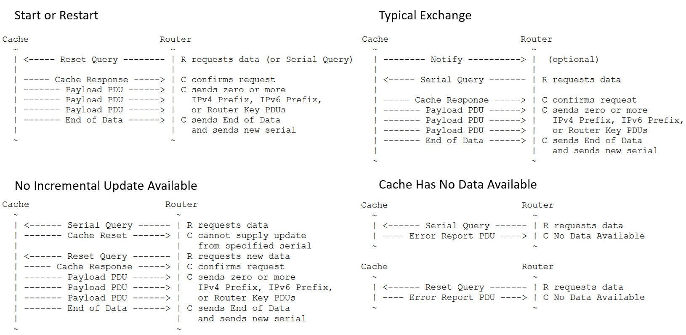

===============================
RTR protocol
===============================

.. sectionauthor:: Emile Giot <emile.giot@student.uclouvain.be>
.. sectionauthor:: François Duchêne <francois.duchene@student.uclouvain.be>

The Resource Public Key Infrastructure (RPKI) to Router Protocol is a protocol used to deliver validated
prefix origin data to the routers. It is defined in RFC6820. RTR was designed to be a lightweight protocol
with a low memory footprint. The core of the protocol is to synchronize a database between a validator and 
a router. It is based on incremental transfers and runs on a TCP connection. 
Below is a quick description of the important protocol data units that can be exchanged bewteen 
a cache and a router.

* **Serial Notify**: the cache notifies the routers that the cache has new data.
* **Serial Query**: the router asks for all new announcements and withdrawals.
* **Reset Query**: the router wants to receive the complete content of the database.
* **Cache response**: the cache will answer to a serial query or a reset query with a cache response. This respone is followed by zero or more PDUs payloads and an End of data PDU.
* **IPv4 prefix**: this payload PDU announces an IPv4 prefix - AS number pair.
* **IPv6 prefix**: this payload PDU announces an IPv6 prefix - AS number pair.
* **End of Data**: the cache will send this PDU to announce that the cache response is over.
* **Cache reset**: the cache can answer this PDU to a serial query to inform the router that it is unable to provide an incremental update.
* **Error report**: the cache or the router uses this PDU to report an error to the other.

The typical sequence of PDU exchanges falls in the four diagrams shown below:

